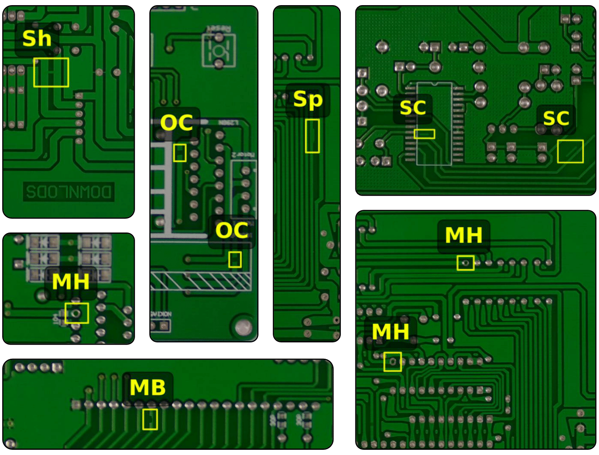
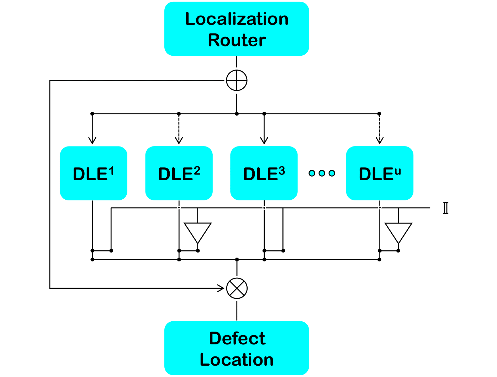
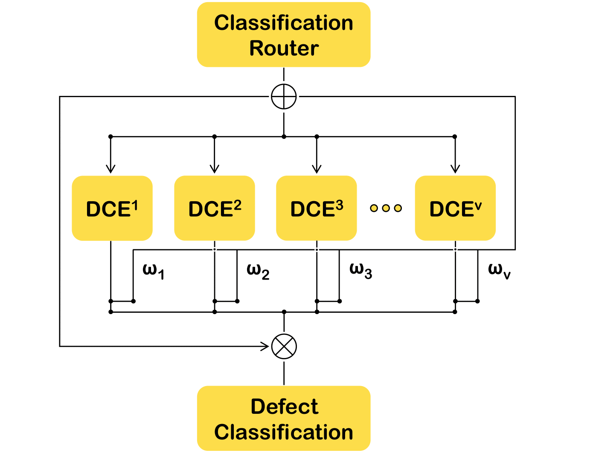
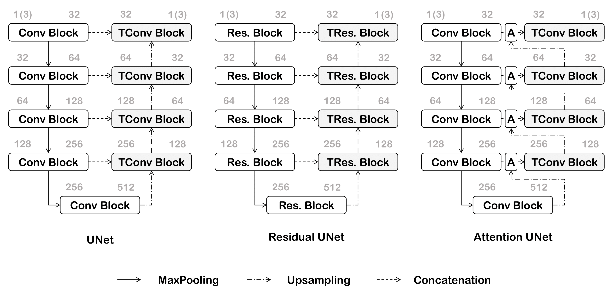
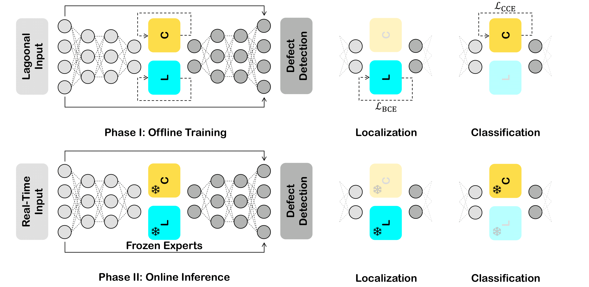
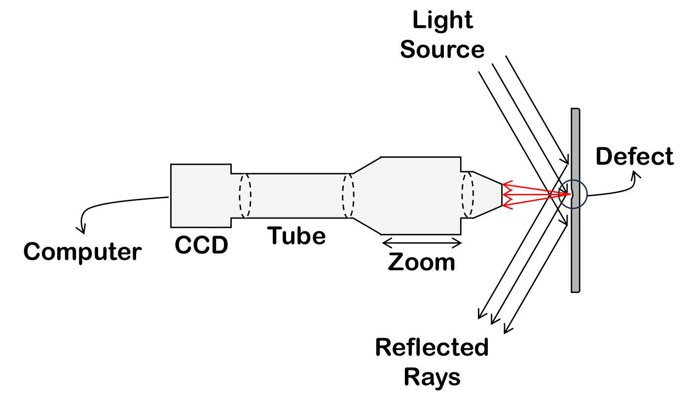
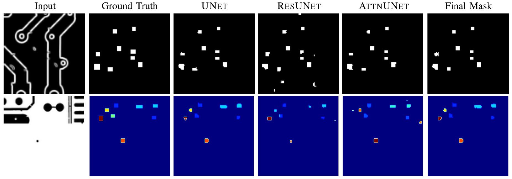

# Dual-Path Mixture-of-Experts Framework for Inline PCB Defect Inspection in Electronics Manufacturing

A frozen-parameter automated optical inspection (AOI) module for real-time PCB defect detection in high-volume manufacturing environments. The framework achieves **5.91% first-pass yield improvement**, **13.57% defect escape reduction**, and **40% throughput gain** with deterministic sub-100ms operation on factory-floor edge hardware.

### Common PCB Manufacturing Defects

  

## Manufacturing Impact

The dual-path inspection module addresses three critical deployment barriers in inline AOI systems:
- **Zero Production Downtime**: Frozen-parameter operation eliminates 4-6 hour retraining delays during board design or supplier transitions
- **Plug-and-Play Integration**: Deploys on standard factory hardware without requiring specialized infrastructure
- **Flexible Batch Handling**: Optional few-shot reconfiguration (~100 examples) enables rapid adaptation without extensive retraining

### Production Performance
- **Detection Accuracy**: 6.30% improvement over existing one-stage detectors, 6.18% over two-stage detectors, 15.18% over transformer-based solutions
- **Cycle-Time Reduction**: 38.60% latency improvement enabling 21-23 inspections/second suitable for inline SMT integration
- **First-Pass Yield**: 5.91% improvement reducing scrap and rework costs
- **Defect Escape Rate**: 13.57% reduction minimizing downstream failures
- **Throughput**: 40% increase (21-23 vs. ≈15 boards/sec) maintaining production schedules

## Framework Architecture

The system combines two complementary pathways using mixture-of-experts (MoE) architecture where multiple specialist models process inputs conditionally based on defect characteristics.

- **Mixture of Localization Experts (MiLE)**: Pixel-level defect identification with spatial precision
- **Mixture of Classification Experts (MiCE)**: Fine-grained defect categorization across manufacturing defect types

<table>
  <tr>
    <td width="50%">
      
    </td>
    <td width="50%">
      
    </td>
  </tr>
  <tr>
    <td align="center"><b>MiLE: Localization Pathway</b></td>
    <td align="center"><b>MiCE: Classification Pathway</b></td>
  </tr>
</table>

### Two-Phase Operational Model

**Phase I - Offline Training**: Experts trained on historical production data with complementary encoder-decoder architectures specializing in different defect patterns and imaging conditions.

  

Each expert architecture handles specific defect characteristics:
- **Classical UNet**: Structured traces and pads under consistent illumination
- **Residual UNet**: Low-contrast or diffuse defects on heterogeneous surfaces
- **Attention UNet**: Component-dense PCBs requiring spatial focus

**Phase II - Online Inference**: Frozen experts execute deterministically on real-time AOI camera streams without parameter updates, maintaining consistent cycle-time throughput.

  

## Manufacturing Validation

### Data Acquisition Setup

  

Validated across four production-representative PCB defect datasets covering diverse manufacturing environments:
- **DeepPCB**: 6 defect classes, 1,500 instances (open, mouse-bite, spurious copper, etc.)
- **HRIPCB**: 6 defect classes, 1,386 instances (missing hole, open circuit, mouse-bite, etc.)
- **DsPCBSD+**: 9 defect classes, 10,259 instances (conductor defects, foreign objects, etc.)
- **PCBA-DET**: 8 defect classes, 4,000 instances (loose components, surface scratches, etc.)

### Robustness Testing
Factory environment validation demonstrates <3% performance degradation under:
- Gaussian noise (σ = 0.01)
- Motion blur (5×5 kernel)
- Brightness variations (±20%)
- Salt & pepper noise (density = 0.02)

## Deployment Configuration

**Hardware Requirements** (Optimal, Training Only):
- CPU: Intel Core i7-1065G7 @ 1.30 GHz (quad-core)
- Memory: 16 GB RAM
- GPU: NVIDIA GeForce MX330 (2 GB VRAM)
- Storage: <500 MB for frozen model weights

**Training Configuration** (Offline, One-Time):
- Optimizer: ADAM (learning rate 1×10⁻⁴)
- Epochs: 50
- Batch Size: 64
- Input Resolution: 96×96 patches for edge deployment
- Training Time: ~4 hours per pathway

**Inference Performance** (Online, Production):
- Latency: 4.64s per batch (64 images) = ~73ms per board
- Throughput: 21-23 inspections/second
- Memory Footprint: <2 GB GPU allocation

## Real-Time Defect Detection Example

  

The example demonstrates adaptive expert routing where the localization pathway selects experts 1 and 3, while classification pathway weights expert contributions (ω₁=0.939, ω₂=0.053, ω₃=0.008) based on input characteristics.

